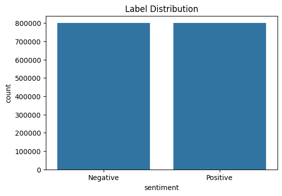
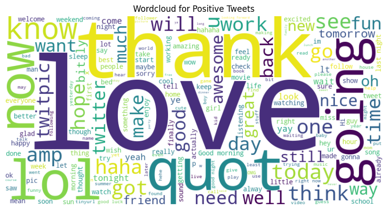
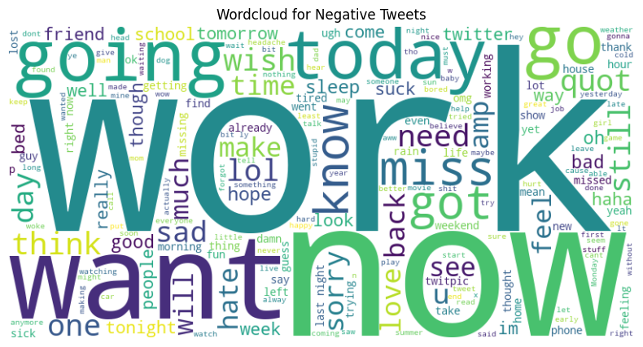
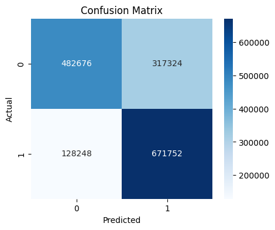
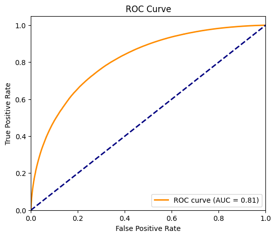

# 💬 Sentiment Analysis

---

## 🏢 Business Objective

Build a robust sentiment analysis system to automatically classify social media posts (tweets) as positive or negative. This helps businesses monitor brand reputation, understand customer feedback, and make data-driven decisions in real time.

---

## 🧠 Problem Statement

Given a large set of tweets, develop a machine learning pipeline to predict the sentiment (positive/negative) of unseen tweets with high accuracy, while handling noisy, unstructured text data.

---

## 📉 Business Constraints

- Must not expose sensitive data or API keys.
- Should process large datasets efficiently.
- Model size should be suitable for cloud/web deployment (under 100MB per file for GitHub/Streamlit Cloud).
- Real-time or near real-time inference for user-facing app.

---

## 📊 Dataset

- **Source:** [Sentiment140 Kaggle Dataset](https://www.kaggle.com/datasets/kazanova/sentiment140)
- **Description:** 1.6 million tweets labeled as positive (1) or negative (0).
- **Note:** Data is not included in the repo due to size; download from Kaggle and place in `data/`.

---

## ⚙️ Tech Stack

- **Language:** Python 3.x
- **Libraries:** pandas, numpy, scikit-learn, nltk, matplotlib, seaborn, wordcloud, joblib, streamlit, scikit-plot
- **Deployment:** Streamlit Cloud

---

## 📈 Workflow

1. **Data Collection:** Download and extract Sentiment140 dataset.
2. **EDA:** Explore label distribution, word clouds, frequent words, class imbalance.
3. **Preprocessing:** Clean text (lowercase, remove stopwords, stemming).
4. **Model Training:** Train Logistic Regression, Naive Bayes, and SVM using TF-IDF features.
5. **Evaluation:** Compare models using accuracy, precision, recall, F1, confusion matrix, ROC curve.
6. **App:** Deploy a Streamlit web app for real-time sentiment prediction.

---

## 📌 Results & Visualizations

### Model Comparison

| Model                | Accuracy | Precision | Recall | F1 Score |
|----------------------|----------|-----------|--------|----------|
| Logistic Regression  | 0.775    | 0.765     | 0.798  | 0.781    |
| Naive Bayes          | 0.756    | 0.773     | 0.727  | 0.749    |
| SVM                  | 0.770    | 0.765     | 0.781  | 0.773    |

### Visuals

- **Label Distribution:**
  

- **Wordclouds:**
  - Positive Tweets: 
  - Negative Tweets: 

- **Confusion Matrix:**
  

- **ROC Curve:**
  

---

## 🎮 Live Demo

- [Streamlit Cloud App](https://sentiment-analysis-on-twitter.streamlit.app)

---

## 💻 How to Run

1. Clone the repo and install dependencies:
   ```bash
   git clone https://github.com/your-username/sentiment-analysis-on-social-media.git
   cd sentiment-analysis-on-social-media
   pip install -r requirements.txt
   ```
2. Download the dataset from Kaggle and place it in `data/`.
3. Train, evaluate, and launch the app:
   ```bash
   python src/train.py data/training.1600000.processed.noemoticon.csv output
   python src/evaluate.py output data/training.1600000.processed.noemoticon.csv
   streamlit run app/app.py
   ```

---

## 🚀 Future Improvements

- Add support for neutral sentiment.
- Integrate BERT or transformer-based models for higher accuracy.
- Deploy as a REST API for broader integration.
- Add multi-language support.
- Real-time Twitter scraping and dashboard.

---

## 🏁 Conclusion

This project demonstrates a full ML pipeline for sentiment analysis, from data to deployment. The app enables real-time sentiment prediction and can be extended for business intelligence, customer support, or social listening.

---

## 📄 License

MIT License. See [LICENSE](LICENSE) for details.

## 📸 Visuals
- 
-  